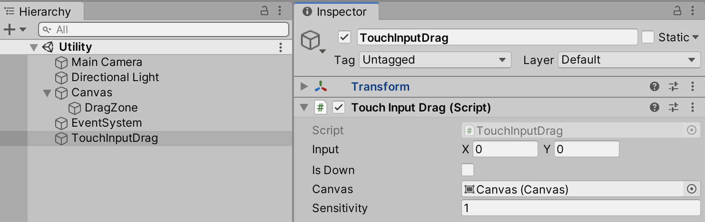
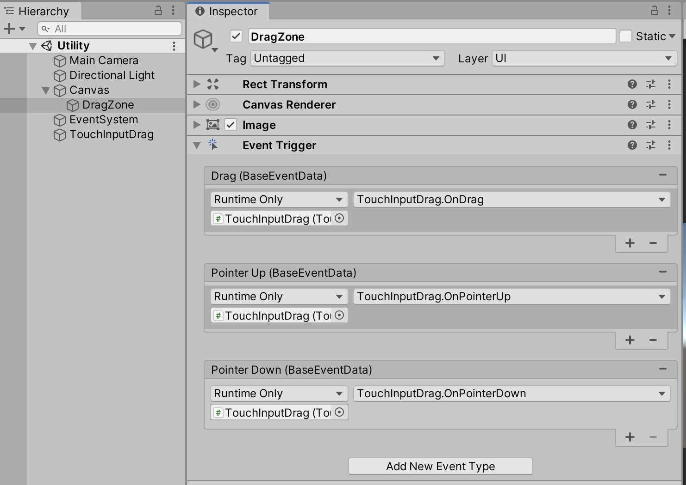
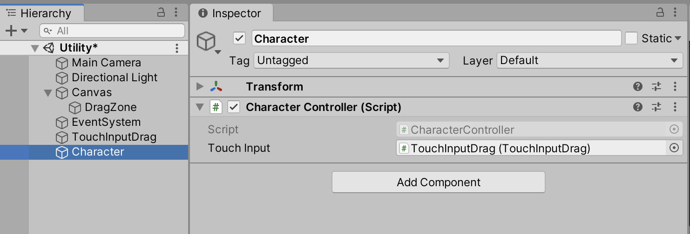

# Touch Input Drag
Component to get an Vector2 from a drag on a rect to use as horizontal/vertical input exposed by the public input.
## Setup

Create an empty gameobject and add the script, I named it TouchInputDrag.
Add an image from UI objects, I named it DragZone(Canvas will be created).

Assign Canvas to the public canvas in the editor, as seen in the picture.



Add a EventTrigger Component to the image.
Add Events "Drag", "PointerUp" and "PointerDown".
For the function select your gameobject TouchInputDrag and select the function in the TouchInputDrag component,
they're named accordingly to the function.



Now you can create a public TouchInputDrag in your CharacterController or wherever you need it exposed.

```csharp
public class CharacterController : MonoBehaviour {
    public TouchInputDrag touchInput;

    void Update(){
        transform.Rotate(0, touchInput.input.x, 0, Space.Self);
    }
}
```

Drag and drop the gameobject with the TouchInputDrag into the exposed editor field.

